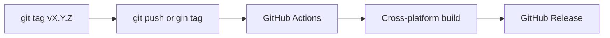

# Releasing

Releases are automated via GoReleaser and GitHub Actions.

## Release workflow



Push a semantic version tag to trigger a release:

```bash
git tag v0.1.0
git push origin v0.1.0
```

The release workflow builds cross-platform binaries (Linux, macOS, Windows on
amd64 and arm64) and publishes them to
[GitHub Releases](https://github.com/gabor-boros/klue/releases).

## Pre-release checklist

- [ ] `make ci` passes on the release commit
- [ ] `make release-check` validates GoReleaser config
- [ ] `make snapshot` produces expected artifacts in `./dist/`
- [ ] `CHANGELOG.md` is up to date (`make changelog` if needed)

!!! warning "Tags are immutable"
    A pushed tag triggers a published release. Verify the snapshot build before
    tagging. To fix a bad release, publish a new patch version rather than
    reusing the tag.

## Validate locally

```bash
make release-check
make snapshot
```

Snapshot artifacts are written to `./dist/` without publishing.

## Changelog

Release notes are generated from conventional commits using git-cliff:

```bash
make changelog           # regenerate CHANGELOG.md
make changelog-current   # print notes for the latest tag
```
