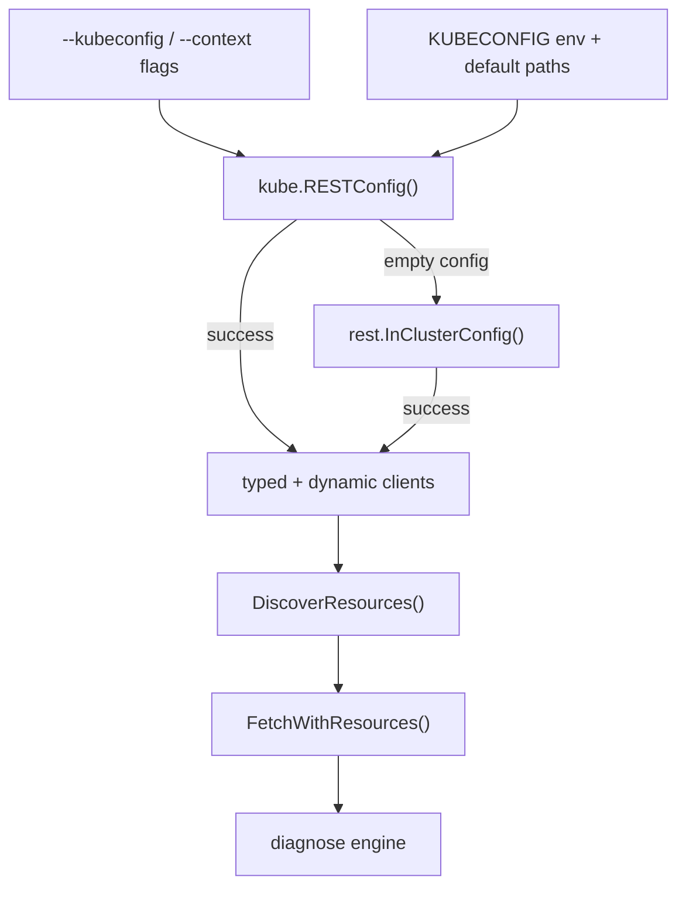

# Kubernetes access

klue uses the standard Kubernetes client-go libraries to connect to your cluster.
It does not implement its own authentication — credentials come from your
kubeconfig or from the in-cluster service account when running inside a Pod.

## Connection flow



## Kubeconfig discovery

When `--kubeconfig` is not set, klue uses client-go's default loading rules — the
same behavior as `kubectl`:

1. The `KUBECONFIG` environment variable (supports multiple files separated by
   `:` on Unix or `;` on Windows).
2. The default file at `~/.kube/config`.

Pass `--kubeconfig` to use an explicit file instead:

```bash
klue why deployment api -n prod --kubeconfig ~/.kube/prod.yaml
```

## Context selection

The `--context` flag selects a named context from the loaded kubeconfig. When
empty, klue uses the kubeconfig's `current-context`.

```bash
klue why pod my-pod -n prod --context prod-west
```

## In-cluster fallback

If no usable kubeconfig is found, klue attempts in-cluster configuration (the
service account token and API server address mounted into a Pod).

!!! info "Running inside the cluster"
    In-cluster mode is useful when klue runs as a Job, an init container, or a
    debug shell inside the cluster. The Pod's ServiceAccount must have RBAC
    permissions to list the resources klue diagnoses.

## Authentication

klue inherits whatever credentials the loaded configuration provides. No
additional login step is required beyond what `kubectl` would need for the same
context.

??? note "Supported credential types"

    - Client certificates and keys
    - Bearer tokens
    - Exec plugins (for example cloud provider CLIs)
    - In-cluster service account tokens

## What happens at runtime

After connecting, klue:

1. **Discovers API resources** — merges a built-in catalog with custom resources
   (CRDs) reported by the cluster's discovery API.
2. **Resolves your resource token** — maps kind, plural name, or alias to a
   single API resource (use `--api-version` when multiple versions exist).
3. **Fetches cluster state** — lists relevant objects in parallel (typed and
   dynamic clients) to build a namespace snapshot and resource graph.
4. **Runs diagnostic rules** — evaluates rules against the graph and indexed
   events, then renders the result.

## Rate limiting and timeouts

klue applies client-side rate limits to avoid overwhelming the API server.
Tune these with global flags (see [Flags](../usage/flags.md)):

| Flag | Default | Purpose |
|------|---------|---------|
| `--client-qps` | `30` | Queries per second limit |
| `--client-burst` | `60` | Burst size above the QPS limit |
| `--fetch-concurrency` | `6` | Parallel list operations during fetch |
| `--timeout` | `0` | Maximum fetch duration (`0` = no extra limit) |

!!! tip "Large clusters"
    If fetches time out or hit rate limits, try lowering `--fetch-concurrency` or
    raising `--timeout` (for example `--timeout 2m`).

## Examples

=== "Default context"

    ```bash
    klue why pod my-pod -n default
    ```

=== "Explicit kubeconfig"

    ```bash
    klue why deployment api -n prod \
      --kubeconfig ~/.kube/prod.yaml \
      --context prod-west
    ```

=== "Multiple kubeconfig files"

    ```bash
    KUBECONFIG=~/.kube/config:~/.kube/prod.yaml \
      klue why pod my-pod -n prod --context prod
    ```
