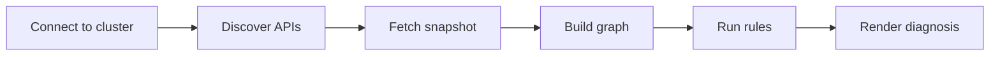

# klue

Kubernetes troubleshooting that explains **why**, not just what.

klue connects to your cluster, builds a resource graph around the object you
care about, and runs diagnostic rules to surface root causes — from crash-looping
pods and stuck deployments to missing ingress backends and cert-manager
certificate failures.

## Quick start

```bash
go install github.com/gabor-boros/klue@latest
klue why pod <name> -n <namespace>  # (1)!
```

1. :material-information-outline: Replace `<name>` and `<namespace>` with your
   target Pod. See [why](usage/why.md) for other resource kinds and CRDs.

!!! tip "Already installed?"
    Run `klue version` to confirm the binary is on your `PATH`, then jump to
    [why](usage/why.md).

See [Installation](getting-started/installation.md) for other install options.

## How it works



1. Connect to a cluster using your kubeconfig (or in-cluster credentials).
2. Discover API resources at runtime, including custom resources (CRDs).
3. Fetch a namespace snapshot and build a resource graph.
4. Run diagnostic rules against the graph and related events.
5. Render a human-readable (or JSON) diagnosis.

## Next steps

| Topic | Page |
|-------|------|
| Cluster connection | [Kubernetes access](getting-started/kubernetes-access.md) |
| CLI commands | [Commands](usage/commands.md) |
| Flags reference | [Flags](usage/flags.md) |
| Diagnose a resource | [why](usage/why.md) |
| Contribute | [Development](development/index.md) |
