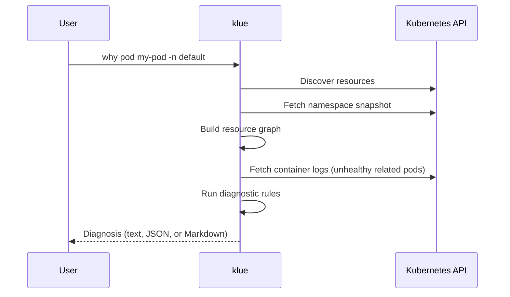

# why

`klue why` diagnoses why a Kubernetes resource is unhealthy. It discovers
resources at runtime (including CRDs), fetches related cluster state, and runs
diagnostic rules to explain root causes.

## Syntax

```bash
klue why <resource> <name> [flags]
```

## Resource tokens

The `<resource>` argument accepts:

- **Kind** — for example `pod`, `deployment`, `certificate`
- **Plural resource name** — for example `pods`, `deployments`, `certificates`
- **Aliases** — kubectl-style short names where defined (for example `deploy`)

klue resolves the token against the built-in catalog plus CRDs discovered on
the cluster.

!!! tip "Custom resources (CRDs)"
    CRDs such as cert-manager `Certificate` objects work out of the box. When a
    token is served by multiple API groups or versions, add `--api-version`:

    ```bash
    klue why certificate my-cert \
      --api-version cert-manager.io/v1 \
      -n cert-manager
    ```

If the token is ambiguous without `--api-version`, klue prints the candidate
apiVersions so you can re-run with the correct one.

## Namespace behavior

Use `-n` / `--namespace` to set the namespace (default: `default`).

| Scope | Behavior |
|-------|----------|
| Namespaced resources | Target is looked up in the given namespace |
| Cluster-scoped resources | Namespace flag is ignored for the target lookup[^cluster] |

[^cluster]:
    Examples of cluster-scoped kinds include `node` and `persistentvolume`.
    Related namespaced objects are still fetched from the specified namespace
    where relevant.

## Diagnosis pipeline



1. **Connect** — load kubeconfig / in-cluster credentials (see
   [Kubernetes access](../getting-started/kubernetes-access.md)).
2. **Discover** — enumerate served API resources (built-ins + CRDs).
3. **Resolve** — map `<resource>` to a single API resource descriptor.
4. **Fetch** — list objects in parallel to build a namespace snapshot and
   resource graph.
5. **Collect logs** — for unhealthy pods related to the target, fetch trailing
   container logs (enabled by default; see [Flags](flags.md)).
6. **Diagnose** — run selected rules against the graph, event index, and log
   excerpts.
7. **Render** — output text (default) or JSON (`-o json`).

## Container logs

By default, klue fetches the last 100 lines from containers on unhealthy pods
related to the diagnosis target (for example pods in `CrashLoopBackOff` owned by
a Deployment). Candidate containers are selected from status and warning-event
signals (for example crash loops, probe failures, and create/config/image-pull
wait states when warning events corroborate them). Log excerpts are ranked,
matched against common failure patterns (panic, OOM, connection refused, DNS
failures, missing config, permission denied), and attached as evidence on
findings.

## Event and log correlation

klue correlates warning events and logs to improve diagnostic confidence while
staying deterministic:

- Pod rules can attach both warning event evidence and log evidence to the same
  finding.
- Warning-event messages are parsed into structured signal categories (image
  pull, scheduling, probe, mount, provisioning) that rules use for focused
  matching and explanations.
- `pod/image-pull`, `pod/probe-failure`, `pod/pending`, `pod/mount-failure`,
  and `pvc/provisioner-stuck` use those structured signals.
- Confidence/ranking prefer corroborated findings when severity is equal.
- Generic warning findings are suppressed when the same event evidence is
  already represented by a stronger typed finding.
- If logs cannot be fetched (RBAC/network constraints), diagnosis still uses
  status and warning events.

## Debug metadata

Use `--debug` to include pipeline observability details in output:

- selected rules
- log candidates and selection reasons
- log fetch counts/errors
- correlation and duplicate-suppression counters

```bash
klue why pod web-abc -n default --debug -o json
```

| Flag | Default | Description |
|------|---------|-------------|
| `--no-fetch-logs` | `false` | Skip container log collection |
| `--log-tail-lines` | `100` | Trailing lines to fetch per container |

Log collection requires `pods/log` **get** permission on the candidate pods.
When log access is denied, diagnosis continues using status and events only.

Log excerpts appear in text and JSON output. Treat output as potentially
sensitive when sharing diagnoses outside your team.

Disable log fetching in automation with:

```bash
klue why deployment api -n prod --no-fetch-logs
```

## Output formats

=== "Text (default)"

    Human-readable diagnosis for terminal use:

    ```bash
    klue why pod web-7fdc4f4d74-jj6hb -n default
    ```

=== "JSON"

    Machine-readable output for scripting and automation:

    ```bash
    klue why certificate my-cert -n cert-manager -o json
    ```

## Examples

```bash
klue why pod web-7fdc4f4d74-jj6hb -n default
klue why pod web-abc -n default --max-depth 2 --event-window 30m
klue why deployment api -n prod --disable-rule builtin/warning-events
klue why certificate my-cert -n cert-manager -o json
klue why certificate my-cert --api-version cert-manager.io/v1 -n cert-manager
```

## Related

- [Commands](commands.md) — command overview
- [Flags](flags.md) — all global and `why` flags with defaults
