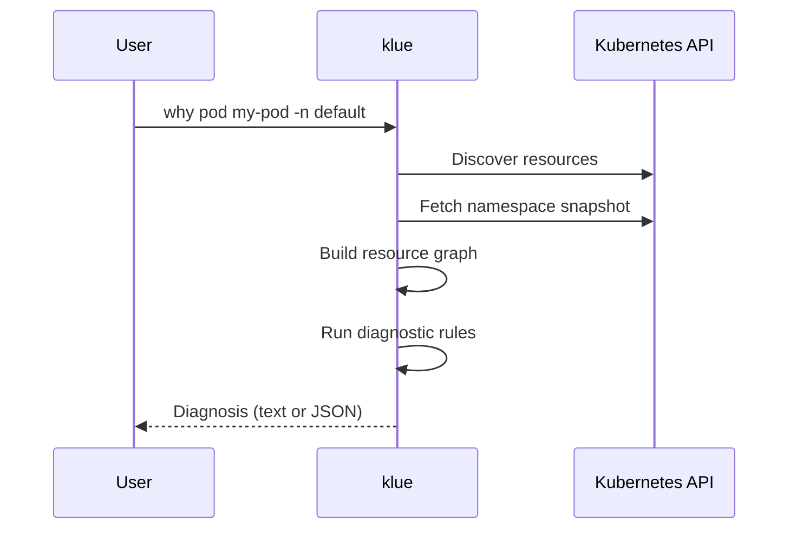

# why

`klue why` diagnoses why a Kubernetes resource is unhealthy. It discovers
resources at runtime (including CRDs), fetches related cluster state, and runs
diagnostic rules to explain root causes.

## Syntax

```bash
klue why <resource> <name> [flags]
```

## Resource tokens

The `<resource>` argument accepts:

- **Kind** — for example `pod`, `deployment`, `certificate`
- **Plural resource name** — for example `pods`, `deployments`, `certificates`
- **Aliases** — kubectl-style short names where defined (for example `deploy`)

klue resolves the token against the built-in catalog plus CRDs discovered on
the cluster.

!!! tip "Custom resources (CRDs)"
    CRDs such as cert-manager `Certificate` objects work out of the box. When a
    token is served by multiple API groups or versions, add `--api-version`:

    ```bash
    klue why certificate my-cert \
      --api-version cert-manager.io/v1 \
      -n cert-manager
    ```

If the token is ambiguous without `--api-version`, klue prints the candidate
apiVersions so you can re-run with the correct one.

## Namespace behavior

Use `-n` / `--namespace` to set the namespace (default: `default`).

| Scope | Behavior |
|-------|----------|
| Namespaced resources | Target is looked up in the given namespace |
| Cluster-scoped resources | Namespace flag is ignored for the target lookup[^cluster] |

[^cluster]:
    Examples of cluster-scoped kinds include `node` and `persistentvolume`.
    Related namespaced objects are still fetched from the specified namespace
    where relevant.

## Diagnosis pipeline



1. **Connect** — load kubeconfig / in-cluster credentials (see
   [Kubernetes access](../getting-started/kubernetes-access.md)).
2. **Discover** — enumerate served API resources (built-ins + CRDs).
3. **Resolve** — map `<resource>` to a single API resource descriptor.
4. **Fetch** — list objects in parallel to build a namespace snapshot and
   resource graph.
5. **Diagnose** — run selected rules against the graph and event index.
6. **Render** — output text (default) or JSON (`-o json`).

## Output formats

=== "Text (default)"

    Human-readable diagnosis for terminal use:

    ```bash
    klue why pod web-7fdc4f4d74-jj6hb -n default
    ```

=== "JSON"

    Machine-readable output for scripting and automation:

    ```bash
    klue why certificate my-cert -n cert-manager -o json
    ```

## Examples

```bash
klue why pod web-7fdc4f4d74-jj6hb -n default
klue why pod web-abc -n default --max-depth 2 --event-window 30m
klue why deployment api -n prod --disable-rule builtin/warning-events
klue why certificate my-cert -n cert-manager -o json
klue why certificate my-cert --api-version cert-manager.io/v1 -n cert-manager
```

## Related

- [Commands](commands.md) — command overview
- [Flags](flags.md) — all global and `why` flags with defaults
